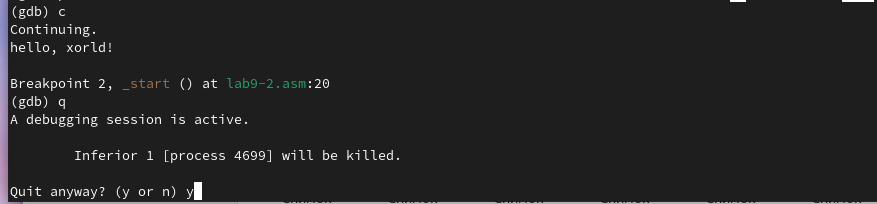

---
## Front matter
title: "Отчет по лабораторной работе №9"
subtitle: "Дисциплина: архитектура компьютера"
author: "Ермакова Анастасия Алексеевна"

## Generic otions
lang: ru-RU
toc-title: "Содержание"

## Bibliography
bibliography: bib/cite.bib
csl: pandoc/csl/gost-r-7-0-5-2008-numeric.csl

## Pdf output format
toc: true # Table of contents
toc-depth: 2
lof: true # List of figures
lot: true # List of tables
fontsize: 12pt
linestretch: 1.5
papersize: a4
documentclass: scrreprt
## I18n polyglossia
polyglossia-lang:
  name: russian
  options:
	- spelling=modern
	- babelshorthands=true
polyglossia-otherlangs:
  name: english
## I18n babel
babel-lang: russian
babel-otherlangs: english
## Fonts
mainfont: IBM Plex Serif
romanfont: IBM Plex Serif
sansfont: IBM Plex Sans
monofont: IBM Plex Mono
mathfont: STIX Two Math
mainfontoptions: Ligatures=Common,Ligatures=TeX,Scale=0.94
romanfontoptions: Ligatures=Common,Ligatures=TeX,Scale=0.94
sansfontoptions: Ligatures=Common,Ligatures=TeX,Scale=MatchLowercase,Scale=0.94
monofontoptions: Scale=MatchLowercase,Scale=0.94,FakeStretch=0.9
mathfontoptions:
## Biblatex
biblatex: true
biblio-style: "gost-numeric"
biblatexoptions:
  - parentracker=true
  - backend=biber
  - hyperref=auto
  - language=auto
  - autolang=other*
  - citestyle=gost-numeric
## Pandoc-crossref LaTeX customization
figureTitle: "Рис."
tableTitle: "Таблица"
listingTitle: "Листинг"
lofTitle: "Список иллюстраций"
lotTitle: "Список таблиц"
lolTitle: "Листинги"
## Misc options
indent: true
header-includes:
  - \usepackage{indentfirst}
  - \usepackage{float} # keep figures where there are in the text
  - \floatplacement{figure}{H} # keep figures where there are in the text
---

# Цель работы

Цель данной лабораторной работы - приобретение навыков написания программ с использованием подпрограмм; знакомство с методами отладки при помощи GDB и его основными возможностями.

# Задание

1. Реализация подпрограмм в NASM
2. Отладка программ с помощью GDB
3. Выполнение заданий для самостоятельной работы

# Теоретическое введение

Отладка — это процесс поиска и исправления ошибок в программе. В общем случае его можно разделить на четыре этапа:

• обнаружение ошибки; 

• поиск её местонахождения;

•определение причины ошибки; 

• исправление ошибки.


Можно выделить следующие типы ошибок:

• синтаксические ошибки — обнаруживаются во время трансляции исходного кода и вызваны нарушением ожидаемой формы или структуры языка; 

• семантические ошибки — являются логическими и приводят к тому, что программа запускается, отрабатывает, но не даёт желаемого результата; 

• ошибки в процессе выполнения — не обнаруживаются при трансляции и вызывают пре- рывание выполнения программы (например, это ошибки, связанные с переполнением или делением на ноль).


Второй этап — поиск местонахождения ошибки. Некоторые ошибки обнаружить доволь- но трудно. Лучший способ найти место в программе, где находится ошибка, это разбить программу на части и произвести их отладку отдельно друг от друга.

Третий этап — выяснение причины ошибки. После определения местонахождения ошибки обычно проще определить причину неправильной работы программы. Последний этап — исправление ошибки. После этого при повторном запуске программы, может обнаружиться следующая ошибка, и процесс отладки начнётся заново.

# Выполнение лабораторной работы
## Реализация подпрограмм в NASM

Создаю каталог для выполнения лабораторной работы №9 (рис. [-@fig:001]).

{#fig:001 width=70%}

Ввожу в файл текст программы из листинга 9.1 (рис. [-@fig:002]).

{#fig:002 width=70%}

Создаю исполняемый файл и запускаю его (рис. [-@fig:003]). Программа выполняет вычисление заданной функции. 

{#fig:003 width=70%}

Изменяю текст программы, добавив подпрограмму _subcalcul в подпрограмму _calcul, для вычисления выражения f(g(x)) (рис. [-@fig:004]).

{#fig:004 width=70%}

Код программы:

```NASM
%include 'in_out.asm'
SECTION .data
msg: DB 'Введите x: ',0
result: DB '2(3x-1)+7=',0
SECTION .bss
x: RESB 80
res: RESB 80
SECTION .text
GLOBAL _start
_start:
;------------------------------------------
; Основная программа
;------------------------------------------
mov eax, msg
call sprint
mov ecx, x
mov edx, 80
call sread
mov eax,x
call atoi
call _calcul ; Вызов подпрограммы _calcul
mov eax,result
call sprint
mov eax,[res]
call iprintLF
call quit
;------------------------------------------
; Подпрограмма вычисления
; выражения "2x+7"
_calcul:
push eax
call _subcalcul
mov ebx,2
mul ebx
add eax,7
mov [res],eax
pop eax
ret ; выход из подпрограммы
_subcalcul:
mov ebx,3
mul ebx
sub eax,1
ret
```

Создаю исполняемый файл и запускаю его (рис. [-@fig:005]). Программа работает исправно.

{#fig:005 width=70%}

## Отладка программ с помощью GDB

Создаю файл lab9-2.asm (рис. [-@fig:006]).

{#fig:006 width=70%}

В файл копирую текст программы из листинга 9.2 (рис. [-@fig:007]). 

{#fig:007 width=70%}

Получаю исполняемый файл. Для работы с GDB в исполняемый файл добавляю отладочную информацию. Загружаю файл в отладчик gdb (рис. [-@fig:009]).

{#fig:009 width=70%}

Проверяю работу программы, запустив ее в отладчике с помощью команды run (рис. [-@fig:010]).

{#fig:010 width=70%}

Для более подробного анализа программы устанавливаю брейкпоинт на метку _start, с которой начинается выполнение любой ассемблерной программы, и запускаю ее (рис. [-@fig:011]).

{#fig:011 width=70%}

Смотрю дисассемблированный код программы с помощью команды disassemble начиная с метки _start (рис. [-@fig:012]).

{#fig:012 width=70%}

Переключаюсь на отображение команд с Intel'овским синтаксисом, введя команду set disassembly-flavor intel (рис. [-@fig:013]).

{#fig:013 width=70%}

Различия между синтаксисом ATT и Intel заключаются в порядке операндов (ATT - Операнд источника указан первым. Intel - Операнд назначения указан первым), их размере (ATT - pазмер операндов указывается явно с помощью суффиксов, непосредственные операнды предваряются символом $; Intel - Размер операндов неявно определяется контекстом, как ax, eax, непосредственные операнды пишутся напрямую), именах регистров(ATT - имена регистров предваряются символом %, Intel - имена регистров пишутся без префиксов).

### Добавление точек останова

Включаю режим псевдографики для более удобного анализа программы. С помощью команды i b (info breakpoints) проверяю, что брейкпоинт сохранился. Далее устанавливаю еще одну точку останова по адресу инструкции и просматриваю все установленные точки останова с помощью команды i b (рис. [-@fig:014]).

{#fig:014 width=70%}

### Работа с данными программы в GDB

Просматриваю содержимое регистров командой i r (info registers) (рис. [-@fig:015]).

{#fig:015 width=70%}

Просматриваю содержимое переменных по имени и по адресу (рис. [-@fig:016]).

{#fig:016 width=70%}

Меняю значения переменных по имени и по адресу (рис. [-@fig:017]).

{#fig:017 width=70%}

Вывожу в различных форматах значение регистра edx (рис. [-@fig:018]).

{#fig:018 width=70%}

С помощью команды set изменяю значение регистра ebx (рис. [-@fig:019] - [-@fig:020]).

{#fig:019 width=70%}

{#fig:020 width=70%}

Разница вывода команд p/s $ebx заключается в том, что в первом случае переменной присваивается строковое значение '2', поэтому выводится код ASCII этого символа (это 50 в десятичной системе). Во втором случае переменной присваивается числовое значение 2, поэтому команда выводит указатель на строку. 

Завершаю выполнение программы с помощью команды c (continue)  и выхожу из GDB с помощью команды q (quit) (рис. [-@fig:021]).

{#fig:021 width=70%}

### Обработка аргументов командной строки в GDB

Копирую файл lab8-2.asm, созданный в ходе выполнения предыдцщей лабораторной работы, в файл с именем lab9-3.asm. Создаю исполняемый файл (рис. [-@fig:022]).

{#fig:022 width=70%}

Загружаю исполняемый файл в отладчик с аргументами, используя ключ --args (рис. [-@fig:023]). При запуске аргументы загрузились в стек.

{#fig:023 width=70%}

Устанавливаю точку останова перед первой инструкцией в программе и запускаю ее (рис. [-@fig:024]).

{#fig:024 width=70%}

Просматриваю остальные позиции стека (рис. [-@fig:025]).

{#fig:025 width=70%}

Заметим, что шаг изменения адрема равен 4. Число обусловлено разрядностью системы, а указатель void занимает как раз 4 байта, ошибка при аргументе +24 означает, что аргументы на вход программы закончились.

## Выполнение заданий для самостоятельной работы

1. Преобразую программу из предыдущей лабораторной работы, реализовав вычисление значения функции f(x) как подпрограмму (рис. [-@fig:026]).

{#fig:026 width=70%}

Код программы:

```NASM
%include 'in_out.asm'

SECTION .data
msg_func db "Функция: f(x) = 8x - 3", 0
msg_result db "Результат: ", 0

SECTION .text
GLOBAL _start

_start:
mov eax, msg_func
call sprintLF

pop ecx
pop edx
sub ecx, 1
mov esi, 0

next:
cmp ecx, 0h
jz _end
pop eax
call atoi

call _calculate_fx

add esi, eax
loop next

_end: 
mov eax, msg_result
call sprint
mov eax, esi
call iprintLF
call quit

_calculate_fx:
mov ebx, 8
mul ebx
sub eax, 3
ret
```

2. Создаю файл lab9-5.asm (рис. [-@fig:027]), ввожу текст программы из листинга 9.3 (рис. [-@fig:028]).

{#fig:027 width=70%}

{#fig:028 width=70%}

Создаю исполняемый файл и открываю с помощью отладчика (рис. [-@fig:029]).

{#fig:029 width=70%}

Запускаю программу с помощью команды r (run), выводится результат 10, он неверный (рис. [-@fig:030]).

{#fig:030 width=70%}

Затем пошагово просматриваю изменение значений регистров через i r. При выполнении инструкции mul ecx можно заметить, что результат умножения записывается в регистр eax, но так же меняет и edx. Значение регистра ebx не обновляется напрямую, поэтому программма неверно подсчитывает функцию (рис. [-@fig:031]).

{#fig:031 width=70%}

Исправляю найденную ошибку, теперь программа верно считает функцию (рис. [-@fig:033]).

{#fig:033 width=70%}

Код исправленной программы:

```NASM
%include 'in_out.asm'
SECTION .data
div: DB 'Результат: ',0
SECTION .text
GLOBAL _start
_start:
; ---- Вычисление выражения (3+2)*4+5
mov ebx,3
mov eax,2
add ebx,eax
mov eax, ebx
mov ecx,4
mul ecx
add ebx,5
mov edi,eax
; ---- Вывод результата на экран
mov eax,div
call sprint
mov eax,edi
call iprintLF
call quit
```

# Выводы

В ходе выполнения данной лабораторной работы я приобрела навыки написания программ с использованием подпрограмм и познакомилась с методами отладки при помощи GDB и его основными возможностями.

# Список литературы

1. [Архитектура ЭВМ](https://esystem.rudn.ru/mod/resource/view.php?id=1030557)

